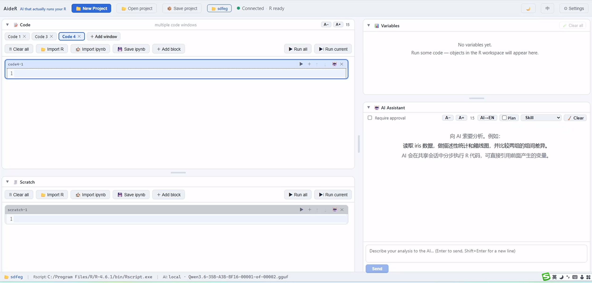

# AideR — AI that actually runs your R

> **Version 1.0.0** · MIT · [中文版介绍 / Chinese](README.zh-CN.md)

> A local R data-analysis workbench where the AI **writes code, runs it, reads the result, and keeps going** — block by block, in your live R session.


## Why AideR is different

Most "AI for R" tools only **chat** — they suggest code you then copy, paste, and run yourself. AideR crosses that line:

- 🔁 **The AI actually runs your R.** Every block of code the AI writes is executed in your real, persistent R session. Nothing is "recommended" — it just runs, produces output/plots, and the AI sees the result.
- 🧱 **The AI operates on each of your code blocks.** Your code window is made of numbered cells (`code1-1`, `code2-3`, scratch `scratch-1`). You can tell the AI *"write and run this in code2-3"* — it lands there, runs, and the result shows under that block.
- 🪞 **It shares your environment.** Because it runs in the same session you use, the AI sees your variables, your past runs, and builds on them — it doesn't work in a vacuum.
- 🪢 **It inspects before acting.** When unsure, it `<r_inspect>`s a variable (read-only) before writing more code.

In short: **you're not talking to a code-reviewer — you're working with a hands-on analyst that does it for you, visibly, block by block.**

## ✨ Highlights

- **Persistent shared R session** — multiple code blocks carry variables/results across, like a Jupyter for R.
- **Multi-step agent loop** — think → run → observe → continue (up to 20 steps), with optional **Plan** that lays out steps first and follows progress.
- **Target any code block** — AI code goes exactly where you name it (`codeN-M` / `scratch-N`), then runs in place.
- **Cross-session memory** — the AI saves notes to a real `memory.md` in your project folder and recalls them later.
- **File-based skills** — one folder per skill (`skills/<name>/skill.md`); if you don't pick one, the AI chooses the best fit itself.
- **Smart editor** — R syntax highlighting, autocomplete (common R functions + your current variables), one-key run of *current block / cursor expression* (handles multi-line calls and `+` / `%>%` continuations).
- **Bilingual UI** — interface language and AI output language toggle **independently**.
- **Privacy-first** — runs against local Ollama by default (data never leaves your machine); can point at any OpenAI-compatible or cloud provider.
- **Zero-friction install** — Node + R, `npm start` and go; Windows one-click scripts included.

## 🖥 Tech stack

| Layer | Tech |
|---|---|
| Frontend | Vue 3 · Vite · CodeMirror 6 · Socket.IO |
| Backend | Fastify · Socket.IO |
| R engine | persistent Node-spawned Rscript child + base64 frame protocol |
| AI | OpenAI-compatible channel (Ollama / LM Studio / OpenAI / Groq / OpenRouter / custom) + Anthropic |

## 📦 Install

### Prereqs
- **Node.js** ≥ 18 (LTS)
- **R** ≥ 4.0 (add to PATH, or set the path in Settings)
- (optional, only if you want AI) **Ollama** — https://ollama.com/download

### Steps
```bash
git clone <your-repo>
cd AideR
npm install
npm start        # builds frontend, starts server → http://127.0.0.1:8787
```
- Dev mode: `npm run dev`
- Windows quick start: run `FirstInstall.bat` once (installs + builds), then `LaunchAssistant.bat`.

## 🚀 Quick start
1. Write R code in the left code blocks; run them with ▶ — variables/results persist in the shared session.
2. Ask the AI in the bottom-right (e.g. *“load the data, summarize it, and boxplot by group”*).
3. The AI writes code, runs it block by block, and gives conclusions you can see.
4. Click **New Project** to pick a folder — saves, memory, and skills all live there.



## ⚙️ Config (`settings.json`)
`ai.provider` (ollama default / custom / openai / groq / openrouter / anthropic / off), `ai.baseUrl`, `ai.apiKey`, `ai.model`, `rscript`. Also editable in **Settings**.

## 🧠 How the AI "actually runs" your R
- Emits `<r_code>…</r_code>` → executes in the shared session → result & plots fed back.
- Inspects with `<r_inspect>…</r_inspect>` (read-only).
- Can write into a named block (`codeN-M` / `scratch-N`) and it runs there.
- Saves memory with `<r_memory>…</r_memory>` to `memory.md`.
- With **Plan** on, first outputs a `<r_plan>` step list.

## 🗂 Structure
```
client/          Vue frontend
server/          Fastify + Socket.IO
  r-engine.js    persistent R session engine
  agent-loop.js  AI multi-step agent
  ai/            provider adapters
  prompt/        editable system prompts (md)
skills/          AI skill templates (folder-per-skill)
scripts/         self-tests (npm test)
```

## 🧰 Skills — global vs per-project
Skills are **just folders of text** the AI reads. There are **two levels**, and they merge:

- **Global skills** live in the repo's own `skills/` folder → available to **every** project.
- **Project-local skills** live in a `skills/` folder **inside a project's folder** → available only for that project. New projects get a `skills/` folder created automatically.

Rule: a local skill **overrides** a global one with the same name. Folder-per-skill structure:
```
skills/<skill-name>/skill.md
```
`skill.md`: the **first line** is the displayed name (e.g. `# Descriptive statistics`), the **rest** is the analysis playbook you want the AI to follow:
- **Add** → make a new `skills/<name>/skill.md` (in the repo's `skills/` or a project's `skills/`).
- **Remove** → delete that skill folder.
- Refresh, and the AI window's **Skill** menu picks them up automatically.

## 🧪 Tests
```
npm test          # self-test
npm run test:env  # check R / AI environment
```

## ❓ FAQ
- **R not ready** → install R / set Rscript path in Settings.
- **AI says "need API key"** → use local Ollama, or enter your key.
- **AI "fetch failed"** → Ollama not running / wrong URL; run `ollama serve`.
- **Browser can't see the folder's absolute path** → Windows security; use the optional "Full path" field to record it.

## 📄 License
MIT. For personal or institutional research use.

---
*The brand name shows in the top bar (`client/src/App.vue`), browser title (`client/index.html`), and editor hover. Change them in one place in `client/index.html` and the i18n `brand` key.*
